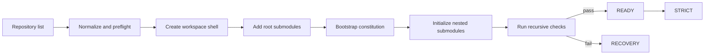

# workspace-init

> **One repository list in. One local development workspace out.**

[](./SKILL.md)
[](./LICENSE)

[简体中文](./README.zh-CN.md)

`workspace-init` initializes a local aggregation workspace from one or more user-provided code repositories. It creates the directory layout, registers root-level Git submodules, preserves nested submodules, and bootstraps the workspace constitution.

It is intentionally not a business-code generator or a repository hosting service. The root is a local convenience layer; actual code remains in the repositories under `repos/`.

## Why This Exists

A multi-repository project needs more than a collection of clones:

- a predictable directory route
- explicit repository ownership
- reproducible submodule wiring
- a safe initialization boundary for `AGENTS.md`
- progressive disclosure instead of one oversized instruction file

This Skill turns those requirements into a repeatable initialization flow.

## What You Get

| Capability | Result |
|---|---|
| Workspace layout | `docs/`, `skills/`, `tasks/`, `.AGENTS/`, and `repos/` |
| Repository wiring | Root `.gitmodules` with one entry per supplied repository |
| Nested repository support | Existing child `.gitmodules` and nested submodules remain intact |
| Constitution bootstrap | `AGENTS.md`, `AGENTS-BOT.md`, `.AGENTS/README.md`, and `.AGENTS/routes.md` |
| Language-aware bootstrap | `AGENTS.md` follows the user's initialization language; maintained guidance stays English by default |
| Verification gate | Structure, content, branch, URL, commit, and recursive submodule checks |
| Recovery guidance | Safe handling for interrupted initialization and explicit conflicts |

## The Flow



The root workspace is never treated as the place where business features are developed:

```text
local aggregation workspace
└── repos/
    ├── service-repository/       # feature branches and code commits live here
    ├── frontend-repository/
    │   └── nested-sdk/           # commit its changes in its own repository
    └── cli-repository/
```

## Quick Start

Install both the Skill entrypoint and its progressive-disclosure references into your Agent Skills directory. For Claude Code:

```bash
mkdir -p ~/.claude/skills/workspace-init/references
cp SKILL.md ~/.claude/skills/workspace-init/SKILL.md
cp references/*.md ~/.claude/skills/workspace-init/references/
```

Then provide a target path and a repository list:

```text
Initialize a workspace at ~/work/my-project:
- sandbox-bridge: https://git.example.com/team/sandbox-bridge.git, default branch main
- gateway: https://git.example.com/team/gateway.git, default branch master
```

The target must not exist or must be empty. The Skill will perform the equivalent of:

```bash
git init
mkdir -p docs skills tasks .AGENTS repos
git submodule add --branch <default-branch> <url> repos/<name>
git submodule update --init --recursive
```

## Generated Layout

```text
my-project/
├── .AGENTS/
│   ├── README.md              # on-demand rule loading
│   └── routes.md              # verified directory and ownership routing
├── docs/                      # local workspace documentation; may be empty
├── repos/                     # actual repositories and nested submodules
├── skills/                    # local executable skills; may be empty
├── tasks/                     # requests and task materials; may be empty
├── .gitmodules                # local root submodule registrations
├── AGENTS.md                  # initialized in the user's language, then protected
└── AGENTS-BOT.md              # maintained workspace-level guidance, English by default
```

## Language Policy

Language is selected only for the initialization-time `AGENTS.md` constitution:

- detect the dominant language of the user's initialization request
- write `AGENTS.md` headings, explanations, and placeholders in that language
- if the request is mixed or ambiguous, ask or use the dominant language of the substantive instructions
- keep `AGENTS-BOT.md`, `.AGENTS/README.md`, `.AGENTS/routes.md`, and generated operational guidance in English by default
- preserve user-written text instead of translating or overwriting it during recovery

For Chinese initialization, the required headings become:

```markdown
## 必须读取的文档
## 宪法维护规则
## 根工作区职责
## 子仓库职责
## CI/CD
```

The language choice affects documentation only; it never changes repository paths, Git commands, branch names, or validation rules.

## Two Phases

### `INITIALIZING`

The Skill may create and directly edit the new root `AGENTS.md`. It writes the minimum constitution and leaves project-specific responsibilities and CI/CD details for the user to complete.

### `STRICT`

Strict mode begins only after all required checks pass and the workspace reaches `READY`:

- root `AGENTS.md` is no longer edited directly
- maintained rules go into `AGENTS-BOT.md` or `.AGENTS/`
- feature branches, code commits, and pushes happen in the actual repositories under `repos/`
- the root remains a local aggregation workspace and does not need branch management or pushes

## References

The core `SKILL.md` is a compact routing entrypoint. Detailed guidance is loaded on demand:

| Reference | Purpose |
|---|---|
| [`input-contract.md`](./references/input-contract.md) | Input normalization, roles, branches, pins, and preflight |
| [`workspace-layout.md`](./references/workspace-layout.md) | Required paths and artifact responsibilities |
| [`constitution-bootstrap.md`](./references/constitution-bootstrap.md) | Constitution templates and initialization states |
| [`submodule-workflow.md`](./references/submodule-workflow.md) | Branches, nested submodules, gitlinks, and authentication |
| [`validation-recovery.md`](./references/validation-recovery.md) | Validation, recovery, and final reporting |
| [`extensions.md`](./references/extensions.md) | Dry runs, resume, manifests, routing, profiles, and hooks |

## Optional Extensions

The reference design leaves room for richer workflows without bloating the core Skill:

- **Enhanced route generation** — enrich the mandatory verified baseline routes from observed repository documentation
- **Resume** — continue only a workspace created by this Skill
- **Manifest** — record repository metadata without credentials
- **Repository profiles** — tailor checks for services, CLIs, plugins, SDKs, and infrastructure
- **Validation reports** — produce a temporary machine-readable or human-readable result

Extensions must never weaken the required verification gate or perform deployment and credential setup implicitly.

## Verification

```bash
test -d docs -a -d skills -a -d tasks -a -d .AGENTS -a -d repos
test -f .gitmodules -a -f AGENTS.md -a -f AGENTS-BOT.md
test -f .AGENTS/README.md -a -f .AGENTS/routes.md
git submodule status --cached --recursive
```

Also verify every root-level submodule's path, URL, default branch, and actual commit. A failed submodule initialization prevents entry into strict mode.

## Development

Keep the core flow small. Add detailed behavior to the appropriate reference, keep generated guidance honest, and update this README when user-visible artifacts or behavior changes.

## License

This project is released under [The Unlicense](./LICENSE), dedicating the code to the public domain as far as legally possible. It permits copying, modification, distribution, and commercial use without attribution. Legal effect varies by jurisdiction.
