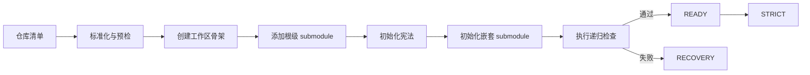

# workspace-init

> **输入一组代码仓库，得到一个可直接本地开发的聚合工作区。**

[](./SKILL.md)
[](./LICENSE)

[English](./README.md)

`workspace-init` 用于根据用户提供的一个或多个代码仓库，初始化统一的本地聚合工作区。它负责创建目录结构、注册根级 Git submodule、保留嵌套 submodule，并初始化工作区宪法和路由文档。

它不是业务代码生成器，也不是仓库托管服务。根目录只是本地聚合和联调层，实际代码仍然位于 `repos/` 下的独立仓库中。

## 为什么需要它

多仓库项目需要的不只是几个 clone：

- 可预测的目录路由
- 清晰的仓库职责边界
- 可复现的 submodule 关系
- 安全的 `AGENTS.md` 初始化边界
- 渐进式披露，而不是一份臃肿的规则文件

这个 Skill 将这些要求整理成一套可重复执行的初始化流程。

## 初始化产物

| 能力 | 产物 |
|---|---|
| 工作区结构 | `docs/`、`skills/`、`tasks/`、`.AGENTS/`、`repos/` |
| 仓库连接 | 根 `.gitmodules`，每个输入仓库一条记录 |
| 嵌套仓库支持 | 保留子仓库自己的 `.gitmodules` 和嵌套 submodule |
| 宪法初始化 | `AGENTS.md`、`AGENTS-BOT.md`、`.AGENTS/README.md`、`.AGENTS/routes.md` |
| 语言感知初始化 | 初始化阶段的 `AGENTS.md` 使用用户语言；维护性文档默认使用英文 |
| 验收门禁 | 目录、文件、分支、URL、commit 和递归 submodule 检查 |
| 恢复指导 | 安全处理中断初始化和显式冲突 |

## 初始化流程



根工作区不会被当作业务功能开发位置：

```text
本地聚合工作区
└── repos/
    ├── service-repository/       # 功能分支和代码提交在这里
    ├── frontend-repository/
    │   └── nested-sdk/           # 变更在 SDK 自己的仓库提交
    └── cli-repository/
```

## 快速开始

将 Skill 入口和渐进式 Reference 文档一起安装到 Agent Skills 目录。以 Claude Code 为例：

```bash
mkdir -p ~/.claude/skills/workspace-init/references
cp SKILL.md ~/.claude/skills/workspace-init/SKILL.md
cp references/*.md ~/.claude/skills/workspace-init/references/
```

然后提供目标路径和仓库清单：

```text
请在 ~/work/my-project 初始化工作区：
- sandbox-bridge: https://git.example.com/team/sandbox-bridge.git，默认分支 main
- gateway: https://git.example.com/team/gateway.git，默认分支 master
```

目标目录必须不存在或为空。Skill 会执行等价于：

```bash
git init
mkdir -p docs skills tasks .AGENTS repos
git submodule add --branch <default-branch> <url> repos/<name>
git submodule update --init --recursive
```

## 标准目录结构

```text
my-project/
├── .AGENTS/
│   ├── README.md              # 按需规则加载说明
│   └── routes.md              # 已验证的目录和职责路由
├── docs/                      # 工作区本地文档，可为空
├── repos/                     # 实际仓库和嵌套 submodule
├── skills/                    # 本地可执行技能，可为空
├── tasks/                     # 需求和任务材料，可为空
├── .gitmodules                # 根级本地 submodule 注册信息
├── AGENTS.md                  # 使用用户语言初始化，完成后保护
└── AGENTS-BOT.md              # 默认使用英文维护的工作区规则
```

## 语言规则

语言选择只影响初始化阶段生成的根 `AGENTS.md`：

- 根据用户初始化请求的主要语言进行判断
- `AGENTS.md` 的标题、解释和占位章节使用该语言
- 如果输入中英混杂或无法判断，使用实质性指令占比最高的语言；必要时先询问用户
- `AGENTS-BOT.md`、`.AGENTS/README.md`、`.AGENTS/routes.md` 以及其他维护性操作文档默认使用英文
- 恢复已有工作区时，保留用户已经写入的内容，不自动翻译或覆盖

中文初始化时，必要章节使用：

```markdown
## 必须读取的文档
## 宪法维护规则
## 根工作区职责
## 子仓库职责
## CI/CD
```

语言选择不会改变目录名、Git 命令、分支名或验收规则。

## 两个阶段

### `INITIALIZING`

初始化期间可以直接创建和修改根 `AGENTS.md`。Skill 只写入最小宪法，并将项目职责和 CI/CD 细节留给用户补充。

### `STRICT`

只有所有必需检查通过、工作区进入 `READY` 状态后，才进入严格模式：

- 不再直接修改根 `AGENTS.md`
- 维护性规则写入 `AGENTS-BOT.md` 或 `.AGENTS/`
- 功能分支、代码提交和推送只发生在 `repos/` 下的实际仓库
- 根目录只做本地聚合，不需要维护或推送根仓库

## Reference 文档

核心 `SKILL.md` 是轻量路由入口，详细内容按需加载：

| Reference | 作用 |
|---|---|
| [`input-contract.md`](./references/input-contract.md) | 输入标准化、角色、分支、固定版本和预检 |
| [`workspace-layout.md`](./references/workspace-layout.md) | 必需路径和文件产物职责 |
| [`constitution-bootstrap.md`](./references/constitution-bootstrap.md) | 宪法模板和初始化状态 |
| [`submodule-workflow.md`](./references/submodule-workflow.md) | 分支、嵌套 submodule、gitlink 和认证 |
| [`validation-recovery.md`](./references/validation-recovery.md) | 验收、恢复和最终报告 |
| [`extensions.md`](./references/extensions.md) | dry run、resume、manifest、路由、profiles 和 hooks |

只读取当前步骤需要的 Reference。

## 可选扩展

Reference 设计为后续扩展保留空间，同时不让核心 Skill 变得臃肿：

- **Enhanced route generation**：从实际仓库文档补充必需的已验证基础路由
- **Resume**：只恢复由本 Skill 创建的中断工作区
- **Manifest**：记录仓库元数据，不记录凭证
- **Repository profiles**：针对 service、CLI、plugin、SDK 和 infrastructure 定制检查
- **Validation reports**：按需生成临时机器可读或人类可读报告

扩展不能削弱必需验收门禁，也不能隐式执行部署或凭证配置。

## 验收检查

```bash
test -d docs -a -d skills -a -d tasks -a -d .AGENTS -a -d repos
test -f .gitmodules -a -f AGENTS.md -a -f AGENTS-BOT.md
test -f .AGENTS/README.md -a -f .AGENTS/routes.md
git submodule status --cached --recursive
```

还需要核对每个根级 submodule 的路径、URL、默认分支和实际 commit。任何 submodule 初始化失败，都不能进入严格模式。

## 开发维护

保持核心流程简洁。详细行为放入对应 Reference；生成的指导必须基于已确认的信息；用户可见的产物或行为发生变化时同步更新 README。

## 许可证

本项目使用 [The Unlicense](./LICENSE)，在法律允许的范围内尽可能将代码释放到公共领域，允许复制、修改、分发和商业使用，不要求署名。不同司法辖区的法律效力可能不同。
